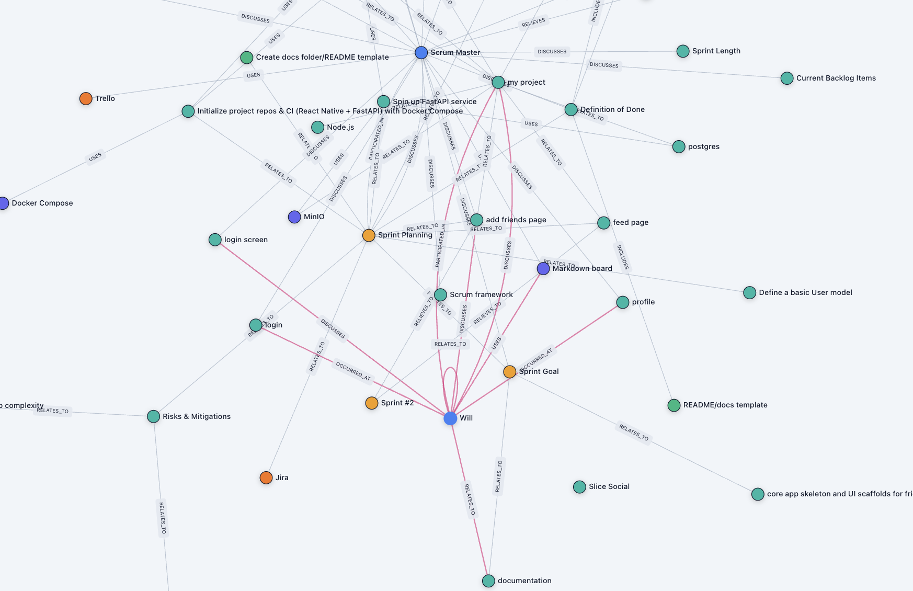

# Scrum Master Agent (Solo Development)

## Overview

The Scrum Master Agent is an AI-driven assistant designed to aid developers in their software projects via the enforcement of Scrum principles. It integrates with _Zep_ for long-term memory and user profiling, ensuring that planning and sprint guidance remain contextual and personalized over time.

---

## User Profiles with Zep

User profiles are persisted in **Zep's Graph Memory**, allowing the agent to personalize guidance. Here's a screenshot of a section of my user graph:\
\

---

## Workflow

1.  _Initialize Profile_
    To initialize a new user profile, run user.ts, and observe the userID that is sent to console. Set user_id in agent.ts to your newly generated ID. Then, ask a question to the agent and your profile is automatically created

2.  _Backlog Creation_
    The agent uses the profile + initial app description to generate a backlog

3.  _Sprint Planning_
    A sprint is created around one vertical slice of functionality (e.g., "Login Page")

4.  _Execution & Tracking_
    Developer logs progress; messages are saved in Zep for context. The agent has access to the time, so when you come back after working, the agent will know how long you have been working for

5.  _Retrospective_
    After the sprint, the agent provides improvement suggestions and updates the backlog. The solo developer is both the product owner and the single developer in the scrum workflow, so the scrum master agent only tries to guide the developer; the agent doesn't take control of the planning in any way

---

## Benefits

- Lightweight Scrum guidance for solo projects
- Persistent memory of user context with _Zep_
- Useful for scrum consultations
